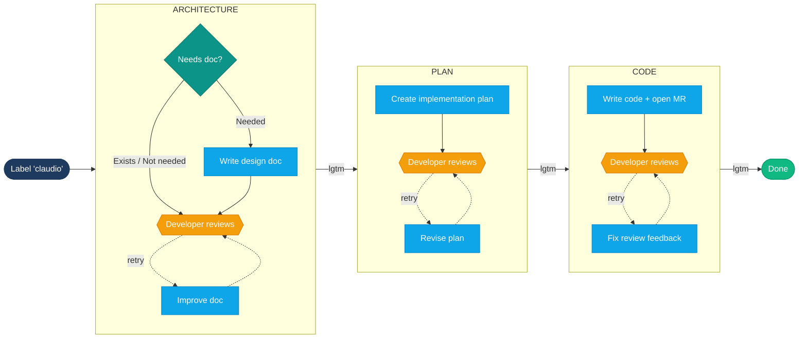

# Board Dispatcher — Approval Flow (simplified)

High-level view of the three-phase lifecycle with approval gates.

**Legend:**
- Blue = AI agent executes
- Amber = Developer reviews (approval gate)
- Dotted arrows = retry loop (developer requests changes)

Human in the loop at every gate. System handles everything in between.
