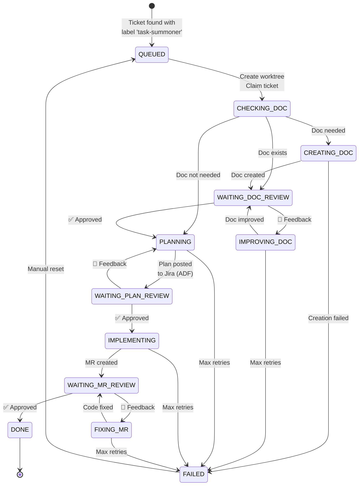
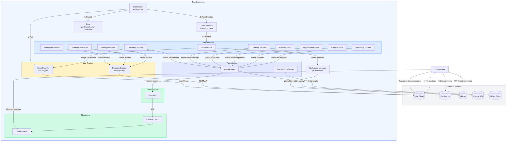
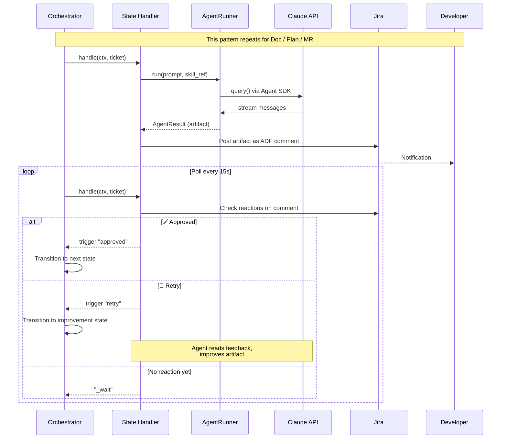

# Task Summoner — Lifecycle Flow

## State Machine

```mermaid
stateDiagram-v2
    [*] --> QUEUED: Ticket found with<br/>label 'task-summoner'

    QUEUED --> CHECKING_DOC: Create worktree<br/>Claim ticket

    CHECKING_DOC --> CREATING_DOC: Doc needed
    CHECKING_DOC --> WAITING_DOC_REVIEW: Doc exists
    CHECKING_DOC --> PLANNING: Doc not needed

    CREATING_DOC --> WAITING_DOC_REVIEW: Doc created
    CREATING_DOC --> FAILED: Creation failed

    WAITING_DOC_REVIEW --> PLANNING: ✅ Approved
    WAITING_DOC_REVIEW --> IMPROVING_DOC: 🔄 Feedback

    IMPROVING_DOC --> WAITING_DOC_REVIEW: Doc improved
    IMPROVING_DOC --> FAILED: Max retries

    PLANNING --> WAITING_PLAN_REVIEW: Plan posted<br/>to Jira (ADF)
    PLANNING --> FAILED: Max retries

    WAITING_PLAN_REVIEW --> IMPLEMENTING: ✅ Approved
    WAITING_PLAN_REVIEW --> PLANNING: 🔄 Feedback

    IMPLEMENTING --> WAITING_MR_REVIEW: MR created
    IMPLEMENTING --> FAILED: Max retries

    WAITING_MR_REVIEW --> DONE: ✅ Approved
    WAITING_MR_REVIEW --> FIXING_MR: 🔄 Feedback

    FIXING_MR --> WAITING_MR_REVIEW: Code fixed
    FIXING_MR --> FAILED: Max retries

    DONE --> [*]
    FAILED --> QUEUED: Manual reset
```

## Component Interaction Flow

```mermaid
flowchart TB
    subgraph External["External Systems"]
        JIRA[("Jira Cloud")]
        CONF[("Confluence")]
        GL[("GitLab")]
        CLAUDE[("Claude API")]
        PLUGIN[("AIOps Plugin")]
    end

    subgraph BD["Task Summoner"]
        ORCH["Orchestrator<br/><i>Polling Loop</i>"]
        SM["State Machine<br/><i>Transition Table</i>"]
        CORE["Core<br/><i>Models / Config / StateStore</i>"]

        subgraph Handlers["State Handlers"]
            H_Q["QueuedState"]
            H_CD["CheckingDocState"]
            H_CR["CreatingDocState"]
            H_WD["WaitingDocReview"]
            H_ID["ImprovingDocState"]
            H_PL["PlanningState"]
            H_WP["WaitingPlanReview"]
            H_IM["ImplementingState"]
            H_WM["WaitingMrReview"]
            H_FX["FixingMrState"]
        end

        subgraph Agent["Agent Layer"]
            AOF["AgentOptionsFactory"]
            AR["AgentRunner"]
        end

        subgraph Tracker["Jira Tracker"]
            JC["BoardProvider<br/><i>acli wrapper</i>"]
            RC["ReactionChecker<br/><i>emoji polling</i>"]
        end

        WS["Workspace Manager<br/><i>git worktrees</i>"]

        subgraph Events["Event System"]
            EB["EventBus"]
        end

        subgraph Monitoring["Monitoring"]
            API["FastAPI + SSE"]
            UI["Dashboard UI"]
        end
    end

    DEV["👤 Developer"]

    DEV -- "Tags ticket 'task-summoner'" --> JIRA
    DEV -- "✅ / 🔄 reactions" --> JIRA
    DEV -- "Inline comments" --> CONF
    DEV -- "MR thread comments" --> GL
    DEV -- "Monitors progress" --> UI

    ORCH -- "1. Poll" --> JC
    JC -- "search/view" --> JIRA
    ORCH -- "2. Resolve state" --> SM
    SM -- "3. Dispatch" --> Handlers
    ORCH -- "4. Persist" --> CORE

    H_Q -- "create worktree" --> WS
    WS -- "git worktree add" --> GL
    H_Q -- "assign + transition" --> JC

    H_CD -- "spawn doc checker" --> AR
    H_CR -- "spawn /create-design" --> AR
    H_PL -- "spawn /ticket-plan" --> AR
    H_IM -- "spawn /ticket-implement" --> AR
    H_FX -- "spawn MR fixer" --> AR
    H_ID -- "spawn doc improver" --> AR

    AR -- "query()" --> CLAUDE
    AOF -- "skill prompts" --> PLUGIN
    AR -- "stream events" --> EB

    H_WD -- "check reaction" --> RC
    H_WP -- "check reaction" --> RC
    H_WM -- "check reaction" --> RC
    RC -- "REST API" --> JIRA

    EB -- "SSE" --> API
    API --> UI

    style External fill:#f3f4f6,stroke:#9ca3af
    style BD fill:#eff6ff,stroke:#2563eb
    style Handlers fill:#dbeafe,stroke:#60a5fa
    style Agent fill:#e0e7ff,stroke:#818cf8
    style Tracker fill:#fef3c7,stroke:#f59e0b
    style Events fill:#d1fae5,stroke:#34d399
    style Monitoring fill:#d1fae5,stroke:#10b981
```

## Approval Gate Pattern

```mermaid
sequenceDiagram
    participant O as Orchestrator
    participant S as State Handler
    participant A as AgentRunner
    participant C as Claude API
    participant J as Jira
    participant D as Developer

    Note over O,D: This pattern repeats for Doc / Plan / MR

    O->>S: handle(ctx, ticket)
    S->>A: run(prompt, skill_ref)
    A->>C: query() via Agent SDK
    C-->>A: stream messages
    A-->>S: AgentResult (artifact)

    S->>J: Post artifact as ADF comment
    J-->>D: Notification

    loop Poll every 15s
        O->>S: handle(ctx, ticket)
        S->>J: Check reactions on comment
        alt ✅ Approved
            S-->>O: trigger "approved"
            O->>O: Transition to next state
        else 🔄 Retry
            S-->>O: trigger "retry"
            O->>O: Transition to improvement state
            Note over S,C: Agent reads feedback,<br/>improves artifact
        else No reaction yet
            S-->>O: "_wait"
        end
    end
```
